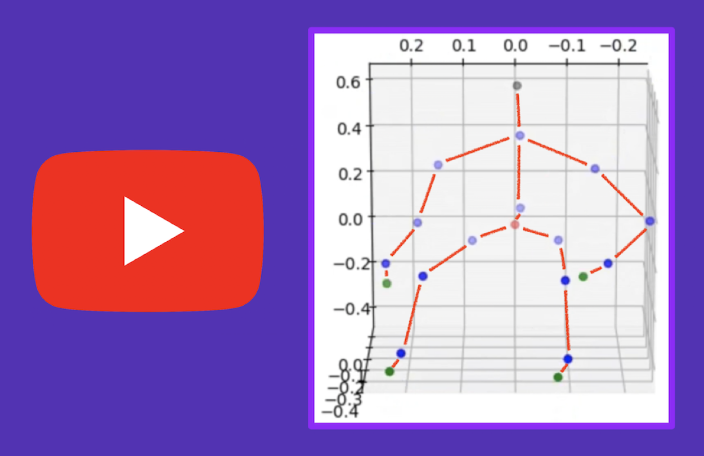
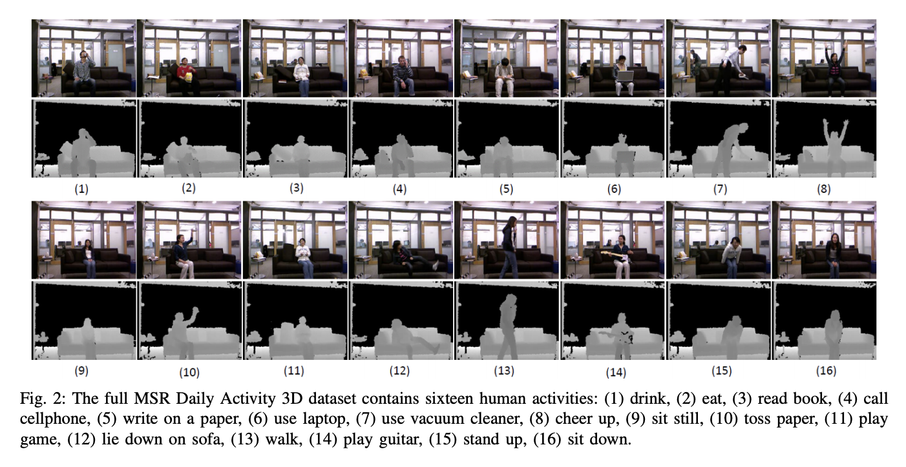

# Moving Pose

## Our Presentation:

<td style="text-align: center;">
  
</td>

## Members:

- Andrew Darling
- Eric Hayes
- Mehmet Yilmaz

## About:

- Given a skeleton based dataset collected from a depth sensor, the goal is to classify certain human actions using the Moving Pose algorithm as well as provide a simple UI.
- To achieve this goal, we implmented the Moving Pose algorithm from the paper stated below and the database stated below.
- This is our Fall 2020 CSCI470 (Introduction to Machine Learning) final Project. CSCI470 is an undergraduate class provided at the Colorado School of Mines. Our team name was: Nestlé.
- Please view /movingpose/gui/README.md to learn more about the GUI and the hardware(s) used.

## Paper Implmented:

- **Title:** _The Moving Pose: An Efficient 3D Kinematics Descriptor for Low-Latency Action Recognition and Detection_
- **Authors:** Mihai Zanfir, Marius Leordeanu, & Cristian Sminchisescu.
- **Paper:** [Zanfir_The_Moving_Pose_2013_ICCV_paper.pdf](https://openaccess.thecvf.com/content_iccv_2013/papers/Zanfir_The_Moving_Pose_2013_ICCV_paper.pdf)

## Dataset Used:

- We used the MSR DailyActivity 3D Dataset dataset: [Dataset_Source](https://wangjiangb.github.io/my_data.html)
- Multiview Action 3D Dataset Action IDs:
  
