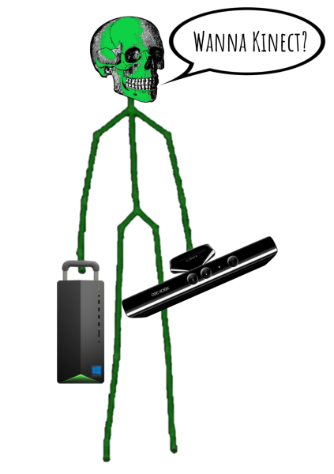

---
# ***DEPRECATED (October 2021)***
---

# Moving Pose
- Team Nestlé CSCI470 Project

## Members:
- Andrew Darling
- Eric Hayes
- Mehmet Yilmaz

## About:
- Given a skeleton based dataset collected from a depth sensor, the goal is to classify certain human actions using the Moving Pose algorithm as well as provide a simple UI.
- To achieve this goal, we implmented the Moving Pose algorithm from the paper stated below and the database stated below.
- This is our Fall 2020 CSCI470 Semester Project for the Colorado School of Mines.
- Please view /movingpose/gui/README.md to learn more about the GUI and the hardware(s) used.

## Paper Implmented:
- **Title:** *The Moving Pose: An Efficient 3D Kinematics Descriptor for Low-Latency Action Recognition and Detection*
- **Authors:** Mihai Zanfir, Marius Leordeanu, & Cristian Sminchisescu.
- **Paper:** [PDF_Source](https://openaccess.thecvf.com/content_iccv_2013/papers/Zanfir_The_Moving_Pose_2013_ICCV_paper.pdf)

## Dataset Used:
- We used the MSR DailyActivity 3D Dataset dataset: [Dataset_Source](https://wangjiangb.github.io/my_data.html)
- Multiview Action 3D Dataset Action IDs:

